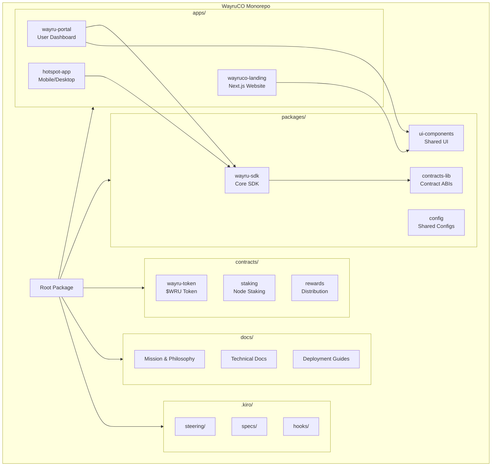

# Design Document: WayruCO Monorepo Hub

## Overview

WayruCO transforms the existing Next.js landing page repository into a comprehensive monorepo hub that preserves Wayru Network's mission-critical technology. The architecture enables community-driven development, automated agent workflows, and easy deployment of decentralized internet infrastructure.

The system uses pnpm workspaces with Turborepo for build orchestration, organizing forked repositories into logical categories while maintaining a unified development experience.

## Architecture



## Components and Interfaces

### 1. Root Configuration Layer

**Purpose:** Orchestrates the monorepo, manages shared dependencies, and provides unified scripts.

**Files:**
- `package.json` - Root package with shared scripts and dev dependencies
- `pnpm-workspace.yaml` - Workspace definitions
- `turbo.json` - Build pipeline configuration
- `tsconfig.base.json` - Shared TypeScript configuration

**Interface:**
```typescript
// Root scripts interface
interface MonorepoScripts {
  // Development
  dev: () => void;           // Start all apps in dev mode
  'dev:landing': () => void; // Start landing page only
  
  // Building
  build: () => void;         // Build all packages
  'build:packages': () => void;
  'build:apps': () => void;
  'build:contracts': () => void;
  
  // Testing
  test: () => void;          // Run all tests
  'test:unit': () => void;
  'test:integration': () => void;
  
  // Maintenance
  lint: () => void;
  format: () => void;
  clean: () => void;
  
  // Repository management
  'repo:sync': () => void;   // Sync with upstream Wayru repos
  'repo:list': () => void;   // List all workspaces
}
```

### 2. Apps Layer

**Purpose:** User-facing applications forked from Wayru Network.

#### 2.1 wayruco-landing (Current Repository)
- **Location:** `apps/landing/` (migrate from root)
- **Technology:** Next.js 14, React 18, Tailwind CSS
- **Purpose:** Community landing page and documentation portal

#### 2.2 wayru-portal (To Fork)
- **Source:** `Wayru-Network/wayru-portal` (if exists)
- **Location:** `apps/portal/`
- **Purpose:** User dashboard for network participation

#### 2.3 hotspot-app (To Fork)
- **Source:** `Wayru-Network/hotspot-*` repositories
- **Location:** `apps/hotspot/`
- **Purpose:** Node operator application

### 3. Packages Layer

**Purpose:** Shared libraries and utilities.

```typescript
// packages/sdk/src/index.ts
export interface WayruSDK {
  // Network operations
  connect(config: NetworkConfig): Promise<Connection>;
  disconnect(): Promise<void>;
  
  // Node operations
  registerNode(params: NodeParams): Promise<NodeRegistration>;
  getNodeStatus(nodeId: string): Promise<NodeStatus>;
  
  // Token operations
  getBalance(address: string): Promise<BigNumber>;
  stake(amount: BigNumber): Promise<Transaction>;
  unstake(amount: BigNumber): Promise<Transaction>;
}

// packages/config/src/index.ts
export interface WayruConfig {
  network: 'mainnet' | 'testnet' | 'local';
  rpcUrl: string;
  contracts: ContractAddresses;
  apiEndpoint: string;
}
```

### 4. Contracts Layer

**Purpose:** Smart contracts for the Wayru token economy.

**Structure:**
```
contracts/
├── wayru-token/        # $WRU ERC-20 token
├── staking/            # Node staking contracts
├── rewards/            # Reward distribution
└── governance/         # DAO contracts (if applicable)
```

### 5. Documentation Layer

**Structure:**
```
docs/
├── mission/
│   ├── PHILOSOPHY.md       # Core beliefs and values
│   ├── VISION.md           # Long-term goals
│   └── HISTORY.md          # Wayru Network history
├── technical/
│   ├── ARCHITECTURE.md     # System architecture
│   ├── API.md              # API documentation
│   └── PROTOCOLS.md        # Network protocols
├── deployment/
│   ├── QUICKSTART.md       # Getting started
│   ├── NODE-SETUP.md       # Running a node
│   └── INFRASTRUCTURE.md   # Infrastructure guides
└── community/
    ├── CONTRIBUTING.md     # How to contribute
    ├── GOVERNANCE.md       # Decision making
    └── CODE-OF-CONDUCT.md  # Community standards
```

### 6. Agentic Workflow Layer

**Purpose:** Enable AI agents to contribute effectively.

**Structure:**
```
.kiro/
├── steering/
│   ├── project-context.md      # Project overview for agents
│   ├── coding-standards.md     # Code style and conventions
│   ├── architecture-guide.md   # Architecture decisions
│   └── workflow-guide.md       # Development workflows
├── specs/
│   └── [feature-specs]/        # Feature specifications
├── hooks/
│   ├── pre-commit.md           # Pre-commit checks
│   └── post-merge.md           # Post-merge actions
└── settings/
    └── mcp.json                # MCP server configuration
```

## Data Models

### Repository Manifest

```typescript
// .wayruco/manifest.json
interface RepositoryManifest {
  version: string;
  lastUpdated: string;
  repositories: Repository[];
}

interface Repository {
  name: string;
  source: string;              // Original GitHub URL
  workspace: string;           // Local workspace path
  category: 'app' | 'package' | 'contract' | 'tool';
  priority: 'critical' | 'important' | 'nice-to-have';
  status: 'pending' | 'forked' | 'integrated' | 'deprecated';
  description: string;
  technologies: string[];
  maintainers: string[];
  upstreamSync: {
    enabled: boolean;
    lastSync: string | null;
    branch: string;
  };
}
```

### Workspace Configuration

```typescript
// Each workspace package.json
interface WorkspacePackage {
  name: string;                 // @wayruco/[name]
  version: string;
  private?: boolean;
  main?: string;
  types?: string;
  scripts: Record<string, string>;
  dependencies?: Record<string, string>;
  devDependencies?: Record<string, string>;
  peerDependencies?: Record<string, string>;
  wayruco?: {
    source: string;             // Original repo URL
    category: string;
    forkedAt: string;
    upstreamCommit: string;
  };
}
```


## Correctness Properties

*A property is a characteristic or behavior that should hold true across all valid executions of a system-essentially, a formal statement about what the system should do. Properties serve as the bridge between human-readable specifications and machine-verifiable correctness guarantees.*

Based on the acceptance criteria analysis, the following properties must hold:

### Property 1: Repository Categorization Consistency

*For any* repository metadata containing technology stack and purpose information, the categorization function SHALL deterministically assign it to exactly one of: `apps/`, `packages/`, or `contracts/` based on defined rules (applications → apps/, libraries/SDKs → packages/, smart contracts → contracts/).

**Validates: Requirements 1.3, 2.1**

### Property 2: Manifest Round-Trip Consistency

*For any* valid repository manifest data structure, serializing to JSON and deserializing back SHALL produce an equivalent data structure with all fields preserved.

**Validates: Requirements 1.2**

### Property 3: Workspace Configuration Integrity

*For any* workspace addition operation, the resulting pnpm-workspace.yaml and turbo.json files SHALL contain valid configurations that include the new workspace path and its build pipeline.

**Validates: Requirements 2.2, 2.4**

### Property 4: DCO Validation Correctness

*For any* git commit message, the DCO validation function SHALL return true if and only if the message contains a valid "Signed-off-by:" line with a name and email address.

**Validates: Requirements 7.2**

### Property 5: Dependency Hoisting Correctness

*For any* set of workspace package.json files with shared dependencies, the dependency resolution SHALL hoist common dependencies to the root package.json while preserving version compatibility.

**Validates: Requirements 2.3**

## Error Handling

### Repository Operations

| Error Condition | Handling Strategy |
|----------------|-------------------|
| GitHub API rate limit | Implement exponential backoff, cache responses, provide offline manifest |
| Repository not found | Log warning, skip repository, continue with others |
| Fork permission denied | Document manual fork process, provide instructions |
| Network timeout | Retry with backoff, fall back to cached data |

### Workspace Operations

| Error Condition | Handling Strategy |
|----------------|-------------------|
| Invalid package.json | Validate before integration, report specific errors |
| Dependency conflicts | Use pnpm's strict mode, report conflicts clearly |
| Build failures | Isolate failing workspace, continue with others |
| Circular dependencies | Detect during integration, reject with explanation |

### Configuration Operations

| Error Condition | Handling Strategy |
|----------------|-------------------|
| Invalid YAML/JSON | Parse with error recovery, report line numbers |
| Missing required fields | Provide defaults where safe, error otherwise |
| Schema validation failure | Report specific validation errors |

## Testing Strategy

### Property-Based Testing

The project will use **fast-check** for property-based testing in TypeScript.

Each property-based test MUST:
- Run a minimum of 100 iterations
- Be tagged with the format: `**Feature: wayruco-monorepo-hub, Property {number}: {property_text}**`
- Reference the specific correctness property from this design document

### Unit Testing

Unit tests will cover:
- Repository metadata parsing
- Categorization logic edge cases
- Configuration file generation
- DCO signature parsing

### Integration Testing

Integration tests will verify:
- End-to-end workspace addition flow
- Build pipeline execution across workspaces
- Documentation generation

### Test Organization

```
tests/
├── unit/
│   ├── categorization.test.ts
│   ├── manifest.test.ts
│   ├── dco-validation.test.ts
│   └── config-generation.test.ts
├── property/
│   ├── categorization.property.ts
│   ├── manifest-roundtrip.property.ts
│   ├── workspace-config.property.ts
│   └── dco-validation.property.ts
└── integration/
    ├── workspace-addition.test.ts
    └── build-pipeline.test.ts
```

## Implementation Phases

### Phase 1: Foundation (Current Sprint)
- Migrate existing landing page to `apps/landing/`
- Set up monorepo tooling (pnpm, turbo)
- Create steering files and documentation structure
- Implement manifest system

### Phase 2: Repository Integration
- Scan Wayru-Network organization
- Prioritize and fork critical repositories
- Integrate as workspaces
- Set up upstream sync mechanism

### Phase 3: Developer Experience
- Create shared UI component library
- Implement SDK package
- Set up CI/CD workflows
- Create deployment templates

### Phase 4: Community Launch
- Finalize documentation
- Set up governance structure
- Launch community channels
- Create contributor onboarding
